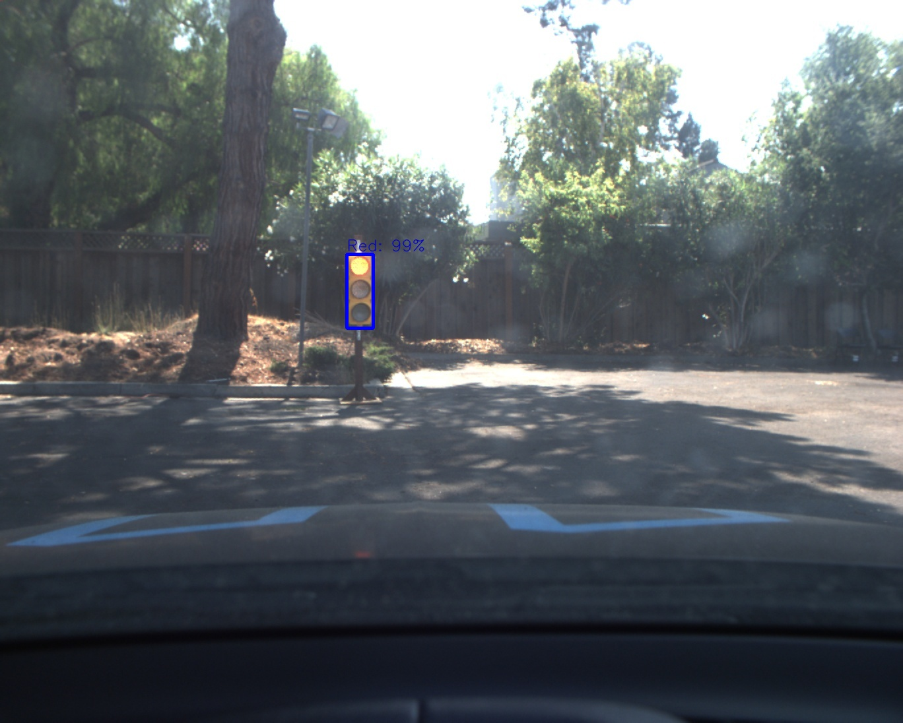
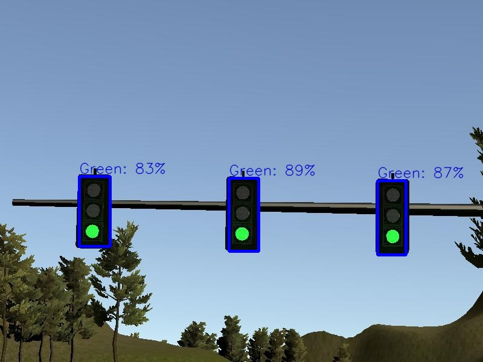
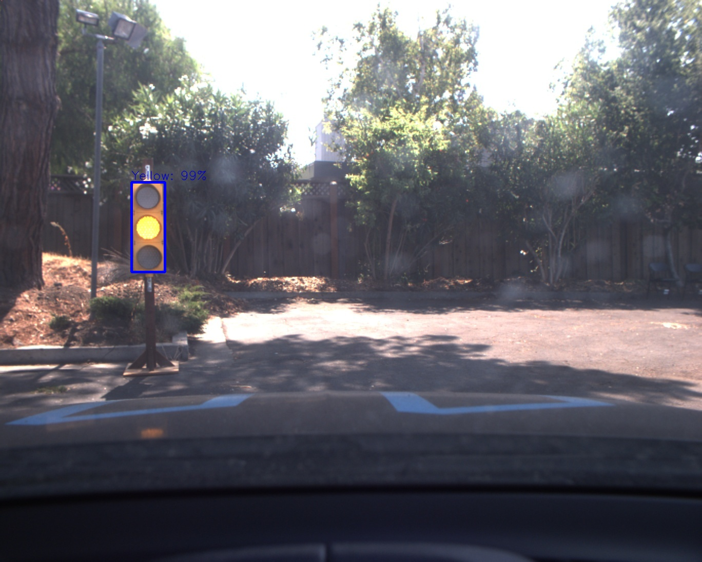
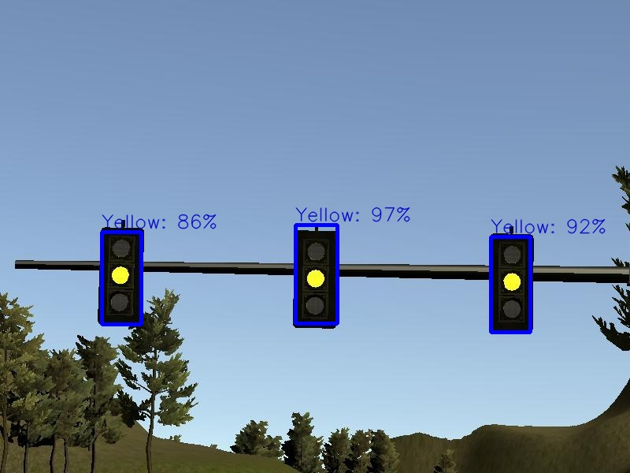
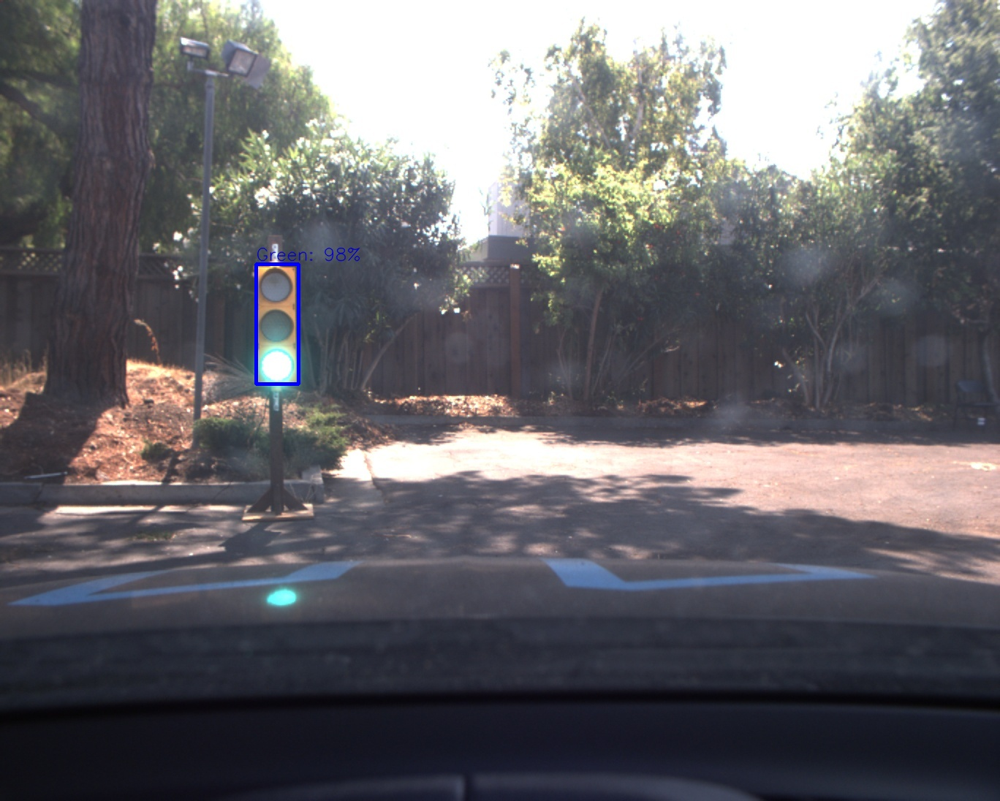
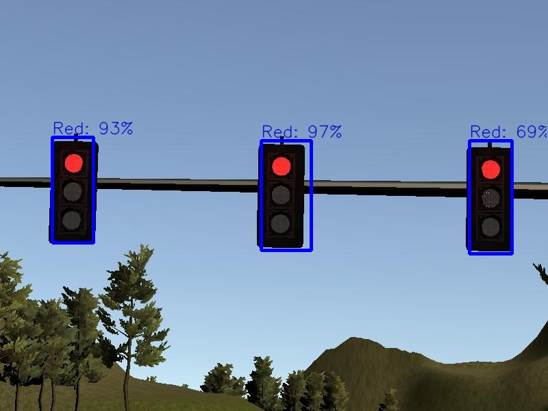

# **Traffic Light Detection**
## Report

---

**Traffic Light Detection**
# Overview
This repository contains all the code needed to run the project for the traffic light detection and classification using Tensorflow Object Detecion in API. This was part of the [final capstone project](https://github.com/mhusseinsh/CarND-Capstone) in Udacity's Self-Driving Car Nanodegree.

Tensorflow's [Object Detection API](https://github.com/tensorflow/models/tree/master/research/object_detection) was used to detect and classify the traffic lights in the images provided by the camera.

# Usage

In this project, [ssd_mobilenet_v1_coco](download.tensorflow.org/models/object_detection/ssd_mobilenet_v1_coco_2018_01_28.tar.gz) which showed good results in terms of performace and runtime.

1- Follow these [steps](https://github.com/tensorflow/models/blob/3f78f4cfd21c786c62bf321c07830071027ebb5e/research/object_detection/g3doc/installation.md) for a proper installation of the API.

2- Downloading Udacity Traffic Light dataset (extracted from the simulator or real data extracted from the provided [bag file](https://s3-us-west-1.amazonaws.com/udacity-selfdrivingcar/traffic_light_bag_file.zip)). The data is already extracted, labelled and provided by [Anthony Sarkis](https://medium.com/@anthony_sarkis), thanks to him!.

3- After downloading the dataset and extracting them, they needed to be converted to TFRecord format which can be done by running:

```python
   python create_udacity_sim_tf_record.py  --input_yaml=data/sim_training_data/sim_data_annotations.yaml  --output_path=data/sim_training_data/sim_data.record
   python create_udacity_sim_tf_record.py  --input_yaml=data/real_training_data/real_data_annotations.yaml  --output_path=data/real_training_data/real_data.record
```
4- Download the pretrained model to be used from [here](https://github.com/tensorflow/models/blob/master/research/object_detection/g3doc/tf1_detection_zoo.md) and extract it into the **models/** folder.

5- Download the *config* file corresponding to the model you just downloaded from [here](https://github.com/tensorflow/models/tree/3f78f4cfd21c786c62bf321c07830071027ebb5e/research/object_detection/samples/configs) and customize it by modifying the data path or the number of iterations or any other hyperparameter that you wish to edit. **Note:** `ssd_mobilenet_v1_coco_sim.config` and others  have been already provided in this repo.

6- Prepare a label mapping file (`*.pbtxt`) and put it into **data/** folder. **Note:** `label_map.pbtxt` has been already provided in this repo.

7- Run the main training script

#### Simulation Data
```python
python train.py --logtostderr --pipeline_config_path=config/ssd_mobilenet_v1_coco_sim.config --train_dir=data/sim_data.record
```
#### Real Data
```python
python train.py --logtostderr --pipeline_config_path=config/ssd_mobilenet_v1_coco_real.config --train_dir=data/real_data.record
```
Now the model is being trained, to be able to track the losses and see how they are changed, tensorboard can be run using the command
```python
tensorboard --logdir=training/
```
8- Export inference graph

When training is finished the trained model needs to be exported as a frozen inference graph.
#### Simulation Data
```python
python export_inference_graph.py --input_type image_tensor --pipeline_config_path=config/ssd_mobilenet_v1_coco_sim.config --trained_checkpoint_prefix=data/outputs/sim_data/model.ckpt-6000 --output_directory=outputs/frozen_model_sim/
```
#### Real Data
```python
python export_inference_graph.py --input_type image_tensor --pipeline_config_path=config/ssd_mobilenet_v1_coco_real.config --trained_checkpoint_prefix=data/outputs/real_data/model.ckpt-25000 --output_directory=outputs/frozen_model_real/
```

9- In order to test the results of the frozen model,a test script is provided which can be modified inside with the path of the frozen model as well as the path of the test images and it will run on all of them.
```python
python test.py
```
A sample of the output is shown below

|                | Left camera                             | Center camera                               | 
| -------------- | --------------------------------------- | ------------------------------------------- |
| Red Light |  |  |
| Yellow Light |  |  |
| Green Light |  |  |

